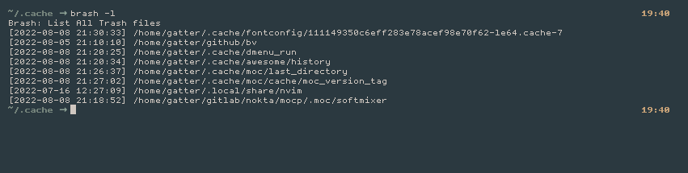
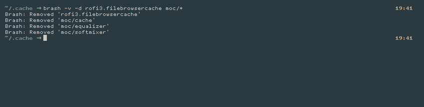
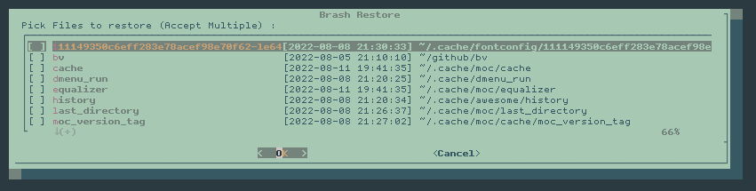

# Brash V0.1.0

## Table of Contents

- [Why Brash](#why-brash)
- [About](#about)
- [Quick Start](#quick-start)
- [Using Brash](#using-brash)
- [Examples](#examples)
- [Help](#help-needed)
- [License](#License)

## Why Brash

Well, why not. As you see its similar to [Trash_cli](https://github.com/andreafrancia/trash-cli). Unlike Trash_cli, [Brash] don't Depends on any Python libs just pure bash.

So why not ?

## About

[Brash] Cli Trash Manager full in Bash

[Brash] allows you to...

* Delete files and folders, even the ones start with "-"
* List out Trash contant
* Clean Trash
* Restore files from trash
* Nice progress viewer of what happened
* Use regular expressions

[Brash] can automatically...

* Rename existing files during Delete or Restore
* Create a trash Folder in Removable Devices

## Quick Start

* Installation requires :
	* [Dialog](https://invisible-island.net/dialog/) for Restore Multi select Dialog
    * [Coreutils](https://www.gnu.org/software/coreutils) for Everything else

    `Probably you just need Dialog`

* Set up [Brash]:

	``` bash
	git clone https://github.com/zakariaGatter/brash.git ~/brash
    cd ~/brash
    git checkout tags/v0.1.0
	mkdir -p ~/.local/bin
	cp bin/brash ~/.local/bin
	chmod +x ~/.local/bin/brash
	```

## Using Brash

```
Brash-0.1.0: Cli Trash Manager in Pure Bash
USAGE: brash [OPTIONS] ... files ...

OPTIONS:
  -d <files>    Move to Trash giving files
  -r            Restore File and Directories from Trash
  -l            List of Deleted files
  -c            Clean Trash Bin
    --date      Sort the Resoult by Date
    --file      Sort the Resoult by file name
  -s            Calculate Trash size
  -i            Ask before every remove
  -I            Ask once before removing more than three files
  -v            Explaine what's been done
  -h            Display this help dialog
  -V            Display Version

NOTE:
  Options
    (--date/--file) options work only with -c,-l,-r Main Options

  Format for '--date' option is (YYYY-MM-DD) or human readable date string
    See: 'man date' for more information.
```

## Preview





## Examples

* Delete file or Directory (Add '-v' for verbose)
    ```
    $ brash -d EX
    $ brash -d EX*
    $ brash -d EX/*
    $ brash -d EX/[A-Z]*
    ```

* Restore file from Trash (Add '-v' for verbose)
    ```
    $ brash -r
    $ brash -r --date "2022-05-05"
    $ brash -r --file vimrc.bk viminfo init.lua
    ```

* Show list of files in trash
    ```
    $ brash -l
    $ brash -l --date "yesterday"
    $ brash -l --file code[1-9].py
    ```

* Clean Trash (Delete permanently)
    ```
    $ brash -c
    $ brash -c --date "week ago"
    $ brash -c --file *.db
    ```

* Show Trash size
    ```
    $ brash -s
    ```

## Help Needed
* Create a man page for [Brash]

## License

MIT License
Copyright (c) 2019 Zakaria Barkouk
The above copyright notice and this permission notice shall be included in all
copies or substantial portions of the Software.

[Brash]:http://github.com/zakariagatter/brash
